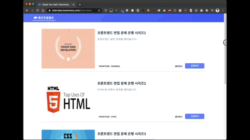

# Check-Your-Self React Project

(체크유얼셀프 리액트 프로젝트)

개발자를 위한 셀프형 피드백에 기반한 모의 인터뷰 프로젝트

(Simple mock interview project based on self-feedback for developers)


# Introduce_소개

## Background_배경

저를 포함하여 많은 개발자 또는 개발자 지망생분들께서 이직과 취업을 준비하고 있습니다.

준비 중간 과정으로 **기술 면접**이 있으며 **준비**가 **필요**합니다.

기술 면접에는 요구사항을 주고 코드를 짜고 설명하는 방식을 진행하는 회사도 있고 지식을 물어보는 방식과 같이 회사 마다 다양한 방식으로 개발자의 역량을 살펴보고 있습니다.

그 중 `간단하게 지식을 물어보는 방식으로 개발자 인터뷰 준비를 할 수 있는 환경`이라도 있다면 도움이 될 것 같다고 생각하게 되어서 `Check-Your-Self`를 만들어보았습니다.

 그러면 **어떻게 하면 도움이 될까**라는 부분이 핵심이였습니다.

다양한 준비 방법이 있고 좀 더 인터뷰 환경에 가깝게 하는 것이 좋다고 생각했습니다.

그리고 추가적으로 2가지를 부가적으로 이용하면 좋겠다고 생각했습니다.

> 1. 인출 효과

인출 효과를 이용한 방법(습득한 지식을 밖으로 표출하여 학습하는 방법)이 효과적이라고 생각했습니다. (하단 참고서적 참고)

인출 효과 방법 중 자신이 학습한 내용을 토대로 눈으로만 읽는 것이 아닌 말로 표현함으로써 말하기 위해서 생각을 하는 과정에서 학습한 지식을 단기기억에서 장기기억으로 넘어가는 것이 효과적이라고 생각합니다.

> 2. 피드백하기

학습에서 중요한건 자신이 학습한 지식에 대해서 피드백을 가져보는 시간이 중요하다고 생각합니다. 자신이 어떤 점을 알고 있고 어떤 점을 모르고 있는지 흔히 말하는 자신을 아는 메타인지가 중요합니다. 자신을 돌아보는 시간을 가짐으로써 부족한 부분을 채워 나갈 수 있습니다. 본 프로젝트에선 스스로 돌아보는 셀프 피드백을 생각해보았습니다.

> 참고서적

> - [함께자라기](https://search.naver.com/search.naver?sm=tab_hty.top&where=nexearch&query=%ED%95%A8%EA%BB%98+%EC%9E%90%EB%9D%BC%EA%B8%B0&oquery=%EC%99%84%EB%B2%BD%ED%95%9C+%EA%B3%B5%EB%B6%80%EB%B2%95&tqi=U1g3Gdp0J1ZssM2%2Bw9wssssss-340386)

> - [소소하지만 확실한 공부법](https://search.naver.com/search.naver?sm=tab_sug.top&where=nexearch&query=%EC%86%8C%EC%86%8C%ED%95%98%EC%A7%80%EB%A7%8C+%ED%99%95%EC%8B%A4%ED%95%9C+%EA%B3%B5%EB%B6%80%EB%B2%95&oquery=%ED%95%A8%EA%BB%98+%EC%9E%90%EB%9D%BC%EA%B8%B0&tqi=U1g38lp0JXVssFi8op8ssssssiR-284863&acq=%EC%86%8C%EC%86%8C%ED%95%98%EC%A7%80%EB%A7%8C+%ED%99%95%EC%8B%A4%ED%95%9C+&acr=2&qdt=0)

> - [완벽한 공부법](https://search.naver.com/search.naver?sm=tab_hty.top&where=nexearch&query=%EC%99%84%EB%B2%BD%ED%95%9C+%EA%B3%B5%EB%B6%80%EB%B2%95&oquery=%EB%A9%94%ED%83%80%EC%9D%B8%EC%A7%80&tqi=U1g31wp0YidssnxLbLossssssUR-159310)

## 부가적인 소개

> 개발적인 부분?을 간단하게 소개한다면

리액트를 이용했으며, TDD공부 하면서 TDD로 코드를 작성하며 개발해 나간 프론트 엔드 프로젝트입니다.

유닛 테스트, 통합 테스트와 E2E 테스트 코드를 작성해보며 주로 어떻게 테스트하고 어떤 부분을 테스트 하면 좋을지에 대한 많은 고민을 하면서 즐겁게 개발해나갔습니다.

> 백엔드 부분은?

프로젝트를 시작할 때, 프론트엔드 부분이 주 관심사여서 초반 개발 환경으로 webpack-dev-server로 mock api를 사용함으로써 백엔드부분을 해결했습니다.

그 후 배포환경으로 현재 프로젝트 버전(v1.0)에는 백엔드 서버를 구현할 필요가 없다고 판단하고 api 요청 시 `/data 폴더` 안 `interviews.js`의 데이터를 가져와서 사용하고 있습니다.

(추후 타입스크립트를 이용해 NodeJs로 추가하고 싶습니다.)

 > CI/CD

CI/CD는 Github Actions 을 이용하였으며, CD는 개발 도중 Github Pages 를 이용하다가 배포시에 [Netlify](https://www.netlify.com/)을 통해 배포 중입니다.

## 시연 화면

> 심플하게 반응형 페이지로 만들었습니다.


> 메인 기능인 인터뷰즈(모의 인터뷰) 모습



# 접속 URL

> Netlify(무료 버전)을 사용하고 있어 대역폭이 낮아 페이지를 불러오는데 시간이 약간 걸립니다.. 😭

https://bit.ly/33oGLai

# Tech Stack_기술 스택

> 일반

- [React(Hooks)](https://ko.reactjs.org/)
- [Redux Toolkit](https://redux-toolkit.js.org/)
- [Redux](https://redux.js.org/)
- [Redux Thunk](https://github.comreduxjss/redux-thunk)
- [Emotion(styled)](https://emotion.sh/docs/styled)
- ..등

> 개발환경

- [Webpack(webpackkdev-server)](https://webpack.js.org/guides/development/#usingwebpackkdevv-server)
- [Eslint](https://eslint.org/)
- ..등

> 테스트관련
- [Jest](https://jestjsioo/)
- [React Testing Library](https://testing-library.com/)
- [codeceptjs](https://codeceptioo/)
- ..등

> 라이브러리

- [react-confirm-alert](https://www.npmjs.com/package/react-confirm-alert)
- [react-lazy-load-image-component](https://www.npmjs.com/package/react-lazy-load-image-component)
- [react-quill](https://www.npmjs.com/package/react-quill)
- ..등

# 프로젝트에 데이터 추가하기

사이트 링크에 데이터를 추가할 수 있습니다. [문제 추가하기](https://github.com/CodeSoom/check-your-self-kwonmory/wiki/%EC%82%AC%EC%9D%B4%ED%8A%B8%EC%97%90-%EB%AC%B8%EC%A0%9C-%EC%B6%94%EA%B0%80%ED%95%98%EA%B8%B0)

또는

Fork를 하여 개인적으로 이용할 수 있습니다. [개인으로 이용하기](https://github.com/CodeSoom/check-your-self-kwonmory/wiki/%EA%B0%9C%EC%9D%B8%EC%9C%BC%EB%A1%9C-%EC%9D%B4%EC%9A%A9%ED%95%98%EA%B8%B0)

# 프로젝트 회고록

- [1&2주 차 주간 회고록](https://kwonmory.github.io/codesoom/codesoom-project-week1-2-retrospective)
- [3주 차 주간 회고록](https://kwonmory.github.io/codesoom/codesoom-project-week3-retrospective)
- [4&5주 차 주간 회고록](https://kwonmory.github.io/codesoom/codesoom-project-week4-5-retrospective)
- [6주 차 주간 회고록](https://kwonmory.github.io/codesoom/codesoom-project-week6-retrospective)
- [최종 회고록](https://kwonmory.github.io/codesoom/ending-codesoom)

# 주 차별 진행 내역

- [1주 차 진행 상황과 목표 링크](https://github.com/CodeSoom/check-your-self-kwonmory/issues/1)
- [2주 차 진행 상황과 목표 링크](https://github.com/CodeSoom/check-your-self-kwonmory/issues/8)
- [3주 차 진행 상황과 목표 링크](https://github.com/CodeSoom/check-your-self-kwonmory/issues/27)
- [4&5주 차 진행 상황과 목표 링크](https://github.com/CodeSoom/check-your-self-kwonmory/issues/30)
- [6주 차 진행 상황과 목표 링크](https://github.com/CodeSoom/check-your-self-kwonmory/issues/64)

# Getting Started_시작하기

```bash

1. npm install

2. npm start

3. Open http://localhost:8080

```

## Watching The Testing Code_테스트 코드 감시하기

```bash

npm run watch

```

## Lint Test_린트 검사하기

```bash

npm run lint

```

## Unit Test_유닛 테스트

```bash

npm run test:unit

```

## Integration Test_통합 테스트

```bash

npm run test  # lint 검사가 제외된 테스트

# or

npm run test:lint # lint 검사가 포함되어있는 테스트

```

## End to End Test_종단 테스트

```bash

npm run test:e2e

```

## Coverage Test_테스트 커버리지보기

```bash

npm run coverage

```

## Production Build_운영 환경으로 빌드하기

```bash

npm run build

```

## Development Build_개발 환경으로 빌드하기

```bash

npm run build:dev

```
